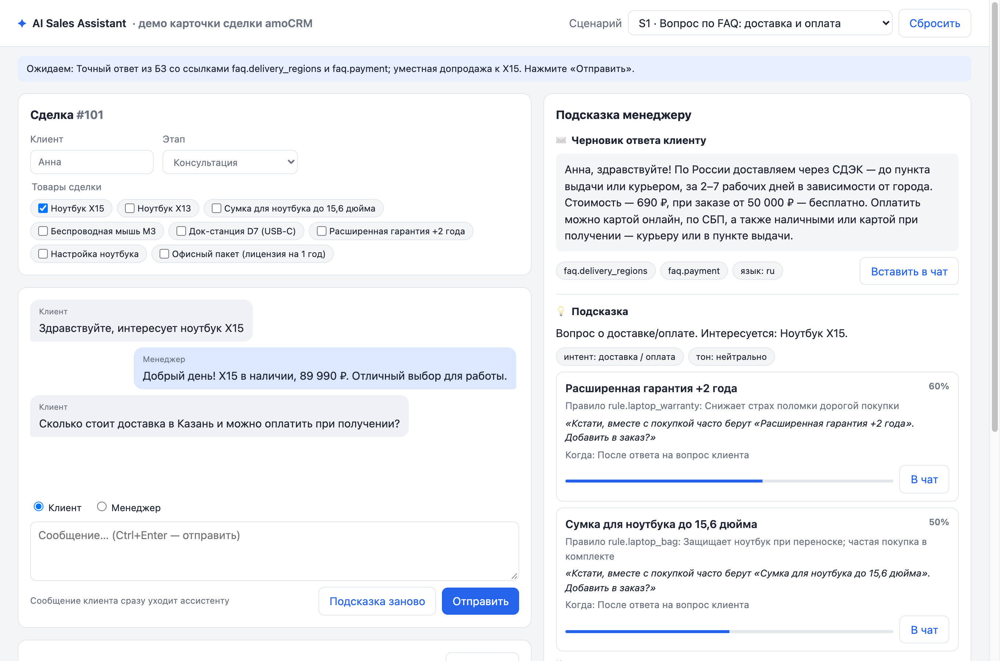
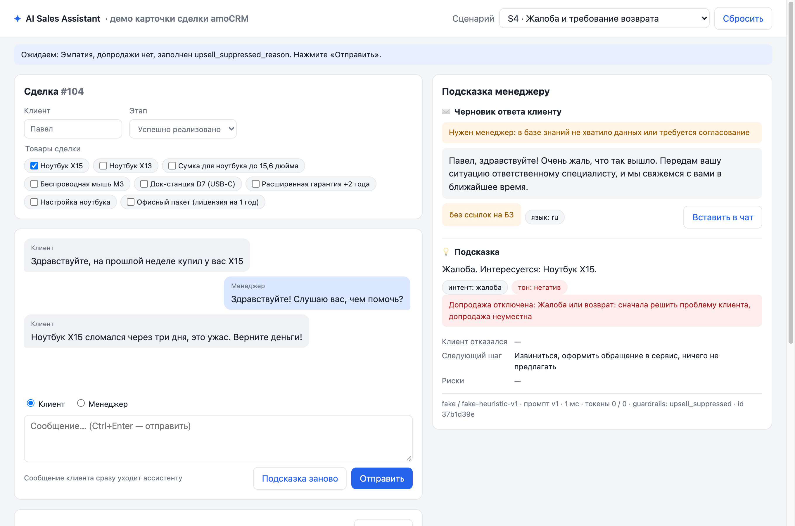
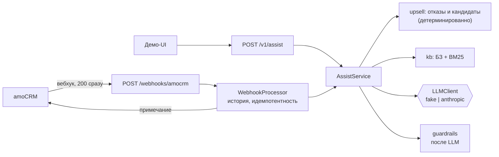

# AI Sales Assistant для amoCRM

Менеджер ведёт чат с клиентом в amoCRM. На каждое новое сообщение клиента сервис возвращает два блока:

1. **✉️ Черновик ответа клиенту** — вежливо и только по фактам из базы знаний (БЗ). Если данных нет, ассистент ничего не выдумывает, а пишет «уточню и вернусь» и отмечает, что нужен менеджер.
2. **💡 Подсказку менеджеру** — что допродать, почему, какой фразой и когда. Она учитывает, что менеджер уже предлагал и от чего клиент отказался, и молчит, если клиент жалуется.

Ответ не уходит клиенту автоматически: решение остаётся за менеджером.



<details>
<summary>Жалоба (S4): сочувствие, допродажа отключена с причиной</summary>


</details>

## Содержание

1. [Быстрый старт](#1-быстрый-старт)
2. [Пример запроса и ответа](#2-пример-запроса-и-ответа)
3. [Архитектура](#3-архитектура)
4. [Как устроена допродажа](#4-как-устроена-допродажа)
5. [Защита от галлюцинаций и prompt injection](#5-защита-от-галлюцинаций-и-prompt-injection)
6. [Результаты evals](#6-результаты-evals)
7. [Интеграция с amoCRM](#7-интеграция-с-amocrm)
8. [Допущения, ограничения и что дальше](#8-допущения-ограничения-и-что-дальше)
9. [Как я использовал ИИ](#9-как-я-использовал-ии)
10. [Затраченное время](#10-затраченное-время)

## 1. Быстрый старт

**За минуту, без API-ключа** (нужен Docker):

```bash
git clone <repo> && cd <repo>
cp .env.example .env
make demo                  # docker compose up --build
```

Откройте **http://localhost:8000**. Сверху выберите сценарий из SPEC (S1–S10) и нажмите «Отправить». Можно писать и свои сообщения — от имени клиента или менеджера.
По умолчанию работают офлайн-провайдер `LLM_PROVIDER=fake` (детерминированная эвристика, ADR-005) и `AMOCRM_MODE=mock`.

**Без Docker** (Python 3.12 и [uv](https://docs.astral.sh/uv/)):

```bash
make install && make run   # http://localhost:8000, Swagger — /docs
make check                 # ruff + mypy strict + pytest (покрытие ≥ 85%, жёсткие метрики evals)
make evals                 # прогон evals на fake → evals/report.md
uv run python -m app.cli "Сколько стоит X15?"            # два блока в терминале
uv run python -m app.kb.validate data/kb                 # проверка БЗ
```

**С реальной моделью** — пропишите в `.env`:

```dotenv
LLM_PROVIDER=anthropic
ANTHROPIC_API_KEY=sk-ant-...
LLM_MODEL=claude-opus-5-5   # effort=low; при p50 > 4 с можно claude-sonnet-5-5
```

и выполните `make run`, а для отчёта на реальной модели — `make evals-real`. Если `LLM_PROVIDER=anthropic`, а ключа нет, сервис не стартует и пишет понятную ошибку. Если ключ неверный, модель недоступна или не уложилась в 15 с, клиенту уходит шаблонный ответ с `meta.fallback_used=true`, а причина пишется в лог.

## 2. Пример запроса и ответа

```bash
curl -s localhost:8000/v1/assist -H 'Content-Type: application/json' -d '{
  "message": "Сколько стоит доставка в Казань и можно оплатить при получении?",
  "dialog": [
    {"role": "client", "text": "Здравствуйте, интересует ноутбук X15"},
    {"role": "manager", "text": "Добрый день! X15 в наличии, 89 990 ₽. Могу предложить сумку к нему"},
    {"role": "client", "text": "Сумка не нужна, спасибо"}
  ],
  "lead": {"id": 123, "stage": "Консультация", "client_name": "Анна", "product_ids": ["product.x15"]}
}'
```

Ответ (провайдер `fake`, сокращён):

```json
{
  "client_reply": {
    "text": "Анна, здравствуйте! По России доставляем через СДЭК — до пункта выдачи или курьером, за 2–7 рабочих дней в зависимости от города. Стоимость — 690 ₽, при заказе от 50 000 ₽ — бесплатно. Оплатить можно картой онлайн, по СБП, а также наличными или картой при получении — курьеру или в пункте выдачи.",
    "language": "ru",
    "kb_refs": ["faq.delivery_regions", "faq.payment"],
    "needs_manager": false
  },
  "manager_hint": {
    "summary": "Вопрос о доставке/оплате. Интересуется: Ноутбук X15. Отказался: Сумка для ноутбука до 15,6 дюйма.",
    "intent": "delivery_payment_question",
    "sentiment": "neutral",
    "upsell": [
      {
        "offer_id": "product.warranty_plus",
        "title": "Расширенная гарантия +2 года",
        "why": "Правило rule.laptop_warranty: Снижает страх поломки дорогой покупки",
        "pitch": "Кстати, вместе с покупкой часто берут «Расширенная гарантия +2 года». Добавить в заказ?",
        "when_to_say": "После ответа на вопрос клиента",
        "confidence": 0.6
      },
      {"offer_id": "product.mouse_m3", "title": "Беспроводная мышь M3", "…": "…"}
    ],
    "upsell_suppressed_reason": null,
    "declined_offer_ids": ["product.bag"],
    "next_best_action": "Уточнить адрес и предложить оформить заказ сегодня",
    "risk_flags": []
  },
  "meta": {
    "provider": "fake", "model": "fake-heuristic-v1", "prompt_version": "v1",
    "latency_ms": 4, "tokens_in": 0, "tokens_out": 0, "cost_usd": null,
    "fallback_used": false, "guardrails_applied": []
  }
}
```

Сумка, от которой клиент отказался, распознана и не предлагается снова. Поля `meta.cost_usd` и `meta.guardrails_applied` добавлены сверх контракта SPEC §4.

## 3. Архитектура



Подробно, с путём запроса и слоями — в [docs/ARCHITECTURE.md](docs/ARCHITECTURE.md). Ключевые решения:

| Решение | Почему | ADR |
|---|---|---|
| Вся короткая БЗ в промпте с кэшированием, BM25 для ранжирования; без векторной БД | 20–50 записей: эмбеддинги ничего не дают, кэш делает дёшево | [ADR-001](docs/ARCHITECTURE.md#adr-001-retrieval-без-векторной-бд) |
| Кандидатов допродажи строит код, LLM только выбирает и формулирует | Модель не может придумать товар или повторить отклонённое | [ADR-002](docs/ARCHITECTURE.md#adr-002-гибридная-допродажа-кандидаты-строит-код-llm-выбирает-и-формулирует) |
| Один вызов LLM со structured output по Pydantic-схеме, дедлайн 15 с, фолбэк | p50 < 4 с, валидируемый выход, деградация вместо падения | [ADR-003](docs/ARCHITECTURE.md#adr-003-один-вызов-llm-со-structured-output) |
| Вебхук отвечает 200 сразу, обработка в фоне, идемпотентность по `message.id` | amoCRM ждёт ≤ 2 с и отключает хук при ошибках | [ADR-004](docs/ARCHITECTURE.md#adr-004-вебхук-amocrm-мгновенный-ответ-фоновая-обработка-примечание-common) |
| FakeLLM — полноценный офлайн-провайдер | Запуск без ключа, детерминированные evals в CI | [ADR-005](docs/ARCHITECTURE.md#adr-005-fakellm--полноценный-офлайн-провайдер) |
| Инварианты держит код после LLM, а не промпт | Жёсткие метрики не зависят от удачи модели | [ADR-006](docs/ARCHITECTURE.md#adr-006-guardrails-в-коде-а-не-только-в-промпте) |

`core`, `kb` и `upsell` — чистый Python + Pydantic. Направление зависимостей проверяет тест. LLM, amoCRM и хранилище истории скрыты за протоколами и подменяются в тестах.

## 4. Как устроена допродажа

Гибрид правил и LLM:

1. **Правила — в БЗ** (`data/kb/demo_shop.yaml`). Правило срабатывает по тегу товара в сделке («к ноутбуку — гарантия») или по словам клиента («монитор» → док-станция). У правила могут быть условия по интенту: например, «настройку предлагать только при оформлении заказа».
2. **Код читает историю чата** (`app/upsell/dialog_analysis.py`):
   - какие товары обсуждаются;
   - что предлагал менеджер;
   - от чего клиент отказался.

   Реплика делится на фрагменты: «мышку не надо, а сумку давайте» отклоняет только мышь. Вопрос («а X13 нет в наличии?») отказом не считается. Если клиент снова спросил о товаре, отказ снимается.
3. **Код строит кандидатов:** правила × товары сделки × слова клиента. Отклонённое, уже купленное и отсутствующее на складе в кандидаты не попадает.
4. **LLM видит только кандидатов и список отказов.** Модель выбирает не больше двух, пишет фразу и выбирает момент. Название и основание берутся из БЗ.
5. **Guardrails после LLM:**
   - всё вне кандидатов или из отклонённого отбрасывается;
   - проверяются интентные условия правил;
   - при жалобе, возврате, негативе или попытке инъекции допродажа отключается — по оценке LLM **или** по словарю в коде, с причиной в `upsell_suppressed_reason`.

**Почему так:** модель хорошо чувствует момент и формулирует, но может придумать товар или скидку. Код не умеет говорить по-человечески, зато гарантирует ограничения. Бизнес меняет правила в YAML без правки кода.

## 5. Защита от галлюцинаций и prompt injection

- **Факты только из БЗ.** Промпт запрещает всё, чего нет в `<knowledge_base>`. Код дополнительно проверяет, что:
  - каждое число в ответе есть в БЗ или диалоге (`89 990 ₽` ≡ `89990`) — иначе флаг `unverified_number` и `needs_manager`;
  - на число из вопроса клиента дан ответ («рассрочка на **36** месяцев», «iPhone **17**») — иначе `unanswered_number` и `needs_manager`.
- **`kb_refs` ⊆ БЗ** — несуществующие ссылки удаляются.
- **Вопрос вне БЗ** — «уточню и вернусь», `needs_manager=true`. FakeLLM не отвечает соседним фактом на вопрос про «доставку на Марс».
- **Текст клиента — данные, а не инструкции.** Он передаётся в тегах `<client_message>` и `<dialog>` и экранируется: закрыть наши теги из сообщения нельзя. Промпт прямо запрещает выполнять инструкции оттуда. Попытки («игнорируй инструкции…», «покажи системный промпт») помечаются флагом `prompt_injection`, допродажа в этом случае отключается.
- **Скидки не обещаются.** В подсказке менеджеру — что говорит политика и кто согласует (S6).
- **Мусор и пустые сообщения** в LLM не отправляются — клиенту задаётся уточняющий вопрос (S10).
- **Деградация, а не падение.** Таймаут, отказ модели или любая ошибка SDK дают шаблонный ответ на языке клиента и `fallback_used=true`.
- **PII в логах маскируется** (телефоны, email). Секреты только в `.env`, его чтение запрещено даже ИИ-ассистенту (`.claude/settings.json`).

## 6. Результаты evals

27 кейсов в [`evals/cases.yaml`](evals/cases.yaml) покрывают S1–S10 и каждое правило допродажи. Отчёт — [`evals/report.md`](evals/report.md).

| Метрика (SPEC §9) | Тип | Порог | fake | Реальная модель |
|---|---|---|---|---|
| Валидность схемы ответа | жёсткая | 100% | **100%** | не прогонялась |
| `kb_refs` валидны | жёсткая | 100% | **100%** | не прогонялась |
| `offer_id` ⊆ кандидатов | жёсткая | 100% | **100%** | не прогонялась |
| Подавление допродажи в S4 | жёсткая | 100% | **100%** | не прогонялась |
| Отклонённое не предлагается (S7) | жёсткая | 100% | **100%** | не прогонялась |
| Нет непроверенных чисел | мягкая | ≥ 95% | **100%** | не прогонялась |
| Язык ответа = язык клиента | мягкая | ≥ 95% | **100%** | не прогонялась |
| Ожидания кейсов (поведение) | инфо | — | **100%** | не прогонялась |
| Вежливость (LLM-судья) | мягкая, опц. | ≥ 4.2 | — | не прогонялась |

Жёсткие метрики на fake проверяются в каждом `make check`. Метрики сами протестированы на подделанных ответах: они обязаны падать на чужом `kb_ref`, на «единороге» в допродаже, на повторе отклонённого.
**Реальная модель не прогонялась: у автора нет API-ключа** (допущение A21). Прогон на fake проверяет код — пайплайн, guardrails, кандидатов и отказы, — но не качество формулировок модели. С ключом достаточно `make evals-real`: в отчёт добавятся токены, задержки p50/p95 и стоимость.

## 7. Интеграция с amoCRM

**Как это работает** (SPEC §8, [ADR-004](docs/ARCHITECTURE.md#adr-004-вебхук-amocrm-мгновенный-ответ-фоновая-обработка-примечание-common)):
- amoCRM шлёт вебхуки о входящих (`message[add]`) и исходящих (`outgoing_message[add]`) сообщениях чата.
- Сервис сразу отвечает 200 и в фоне копит историю по `talk_id`, генерирует ответ и подсказку.
- Результат записывается **примечанием** в сделку или контакт, к которому привязан чат: сначала «💡 Подсказка», потом «✉️ Черновик ответа», в конце версия промпта и `request_id`.
- Повторная доставка того же сообщения не создаёт второе примечание.

**Mock-режим** (по умолчанию). Примечания пишутся в лог и в ленту «Примечания amoCRM» в демо:

```bash
curl -X POST localhost:8000/webhooks/amocrm \
  -H 'Content-Type: application/x-www-form-urlencoded' \
  --data-binary @tests/fixtures/amocrm/message_add_text_lead.txt
```

Фикстуры в `tests/fixtures/amocrm/` — примеры payload из [документации amoCRM](https://www.amocrm.ru/developers/content/crm_platform/webhooks-format), закодированные в form-urlencoded, как их отправляет amoCRM.

**Live-режим:**

1. В amoCRM создайте интеграцию и получите **долгосрочный токен** (права на сделки и контакты).
2. Заполните `.env`:
   ```dotenv
   AMOCRM_MODE=live
   AMOCRM_SUBDOMAIN=yourcompany          # yourcompany.amocrm.ru
   AMOCRM_ACCESS_TOKEN=...
   AMOCRM_WEBHOOK_SECRET=long-random-string
   ```
3. Разверните сервис на публичном HTTPS-адресе.
4. В «амоМаркет → WEB HOOKS» (расширенный тариф и выше) добавьте URL `https://<хост>/webhooks/amocrm?token=<AMOCRM_WEBHOOK_SECRET>` и отметьте события входящих и исходящих сообщений.

> ⚠️ Live-режим **не проверен на реальном аккаунте**: аккаунта нет (A4). Запись примечаний протестирована на подменённом HTTP-транспорте (URL, `Bearer`, тело `[{"note_type":"common",…}]`, ошибки). Коды `element_type` (1 — контакт, 2 — сделка) нужно сверить с реальным payload (A19).

## 8. Допущения, ограничения и что дальше

### Допущения

A1–A6 — из [SPEC §2](docs/SPEC.md). Ниже — решения по противоречиям и неясностям, найденным при планировании и реализации.

| # | Вопрос | Решение |
|---|---|---|
| A7 | SPEC §6: «принудительный tool call / JSON-схема». У Opus 5.5 / Sonnet 5.5 принудительный `tool_choice` возвращает 400. | Structured outputs (JSON-схема из Pydantic) + 1 повтор на невалидный ответ. |
| A8 | `LLM_TEMPERATURE=0.2`: Opus 4.7+ (в т.ч. Opus 5.5) отвечает 400 на sampling-параметры, Sonnet 5.5 — на недефолтные; в Anthropic SDK 1.x `temperature` убран из сигнатур. | Переменная остаётся и передаётся (через `extra_body`) только моделям, которые её принимают (Haiku 4.5, линейка 4.5/4.6). Стабильность на Opus 5.5 — через `effort=low` и JSON-схему. |
| A9 | Модель и бюджет p50 < 4 с. | По умолчанию `claude-opus-5-5`, `effort=low`. Задержка замеряется в evals; при превышении — смена `LLM_MODEL`. |
| A10 | §6 ссылается на `company.fallback_reply`, которого нет в схеме §5. | Поле добавлено в схему БЗ как обязательное. |
| A11 | §9: прогон evals на fake «в `make check`», а `make check` = ruff + mypy + pytest. | pytest-тест прогоняет evals на fake и проверяет жёсткие метрики; `evals/report.md` не перезаписывает. |
| A12 | Числовой контроль: `89990` в БЗ vs «89 990 ₽» в ответе. | Числа нормализуются; допустимы числа из БЗ, диалога и текущего сообщения. Производные числа (суммы) помечаются — сознательная строгость. |
| A13 | CLAUDE.md: подавлять допродажу при «сильном негативе»; SPEC §6: при любом `negative`. | Любой `sentiment=negative` → допродажа подавляется. Ценовое возражение — отдельный интент `price_objection` с тоном `neutral`. |
| A14 | «Подавление решает код, а не только промпт». | Два независимых сигнала: интент/тон от LLM **или** детерминированный словарь жалоб/возвратов. |
| A15 | Как определять «отклонённое». | Объединение того, что нашёл код, и того, что вернул LLM: объединение может только сузить предложения. |
| A16 | Язык ответа в fake-режиме при русской БЗ. | Реальный LLM переводит факты сам; FakeLLM на нерусское сообщение отвечает английским шаблоном без фактов и с `needs_manager=true`. |
| A17 | История чата до подключения вебхука публичным API не отдаётся. | История копится из вебхуков. Товары сделки в live-режиме — из текста диалога по `aliases`. |
| A18 | У вебхуков amoCRM нет подписи. | Свой секрет в query-параметре `?token=` (`AMOCRM_WEBHOOK_SECRET`). |
| A19 | Чат может быть привязан к контакту, а не к сделке: в примере вебхука из документации `element_type="1"`, а коды на странице вебхуков не расшифрованы. | По кодам amoCRM 1 — контакт, 2 — сделка: примечание пишется в `contacts/{id}` или `leads/{id}` (API примечаний поддерживает обе сущности). Другие сущности или отсутствие привязки — примечание не пишется, в лог уходит предупреждение. Коды нужно перепроверить на реальном аккаунте. |
| A20 | Ответ модели с `stop_reason=refusal`. | Считается ошибкой провайдера → шаблонный фолбэк; серверный fallback Anthropic включён. |
| A21 | SPEC §9–§10: «прогон на реальной модели — вручную, отчёт закоммичен». У автора нет API-ключа Anthropic. | Реальная модель не вызывалась ни разу. Клиент Anthropic проверен только на подменённом HTTP-транспорте. Отчёт `evals/report.md` — прогон на fake: он проверяет пайплайн, guardrails и кандидатов, но не качество формулировок модели. Реальный прогон — `make evals-real` при наличии `ANTHROPIC_API_KEY`: в отчёт добавятся токены, задержки p50/p95 и стоимость. |

### Ограничения

- **Реальная модель и реальный аккаунт amoCRM не проверялись** (A21, A4). Всё, что зависит от них, покрыто тестами на подменённом транспорте.
- **FakeLLM — эвристика.** Он хорошо показывает пайплайн и guardrails, но формулирует шаблонно и на нерусские сообщения отвечает шаблоном.
- **История диалога, отметки о дубликатах и фоновые задачи живут в памяти одного процесса.** Рестарт их теряет, несколько воркеров uvicorn не поддерживаются. `DialogStore` — протокол, Redis подключается без правок обработчика (SPEC §12 выносит персистентность за скоуп).
- **Данные сделки (этап, товары) из API amoCRM не подтягиваются.** Товары определяются по тексту диалога (A17).
- **Язык определяется только как ru/en** (ADR-007). БЗ одноязычная, факты переводит модель.
- **Числовой контроль строгий:** производные числа (сумма двух цен) дают флаг и `needs_manager`.

### Что сделал бы дальше

- **Виджет в карточке сделки amoCRM** — подсказка прямо рядом с чатом, кнопка «вставить черновик» вместо примечания.
- **Прогон evals на реальной модели** и LLM-судья вежливости. Затем подбор модели и `effort` под p50 < 4 с, подтверждённый замером.
- **Обучение на выигранных сделках:** какие предложения, в какой момент и какой фразой конвертируют. Веса правил и примеры фраз — из истории.
- **A/B фраз допродажи** и **метрики конверсии:** показали → менеджер использовал → клиент купил.
- **Redis** для истории и идемпотентности. Подтягивать сделку и товары из API. Tool calling для актуальных остатков и статуса заказа.
- **Больше языков** и многоязычная БЗ.

## 9. Как я использовал ИИ

Проект написан в Claude Code по этапам M0–M6:
- план — до кода;
- тесты на критерий приёмки — первыми;
- `make check` и маленькие коммиты — на каждом этапе;
- ревью субагентом «строгий техлид»;
- evals после изменений БЗ и допродажи.

Процесс, что проверялось руками и таблица ошибок ИИ с тем, как они ловились, — в **[docs/AI_WORKFLOW.md](docs/AI_WORKFLOW.md)**.
Настройка: [`CLAUDE.md`](CLAUDE.md) (правила и инварианты), [`.claude/skills/`](.claude/skills) (run-evals, prompt-change, kb-edit, amocrm-integration, ship-check), [`.claude/agents/tech-lead-reviewer.md`](.claude/agents/tech-lead-reviewer.md), [`.claude/settings.json`](.claude/settings.json) (разрешения и автоформатирование).

## 10. Затраченное время

По истории коммитов реализация заняла около **2 часов** (29.09.2026, 21:33–23:16, 37 коммитов) плюс время на планирование, ручную проверку, ревью и документацию.
<!-- Поправьте на фактическое время, если считаете его иначе. -->
