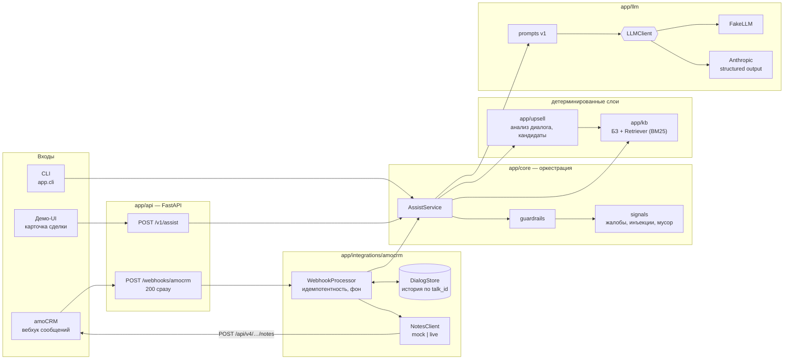
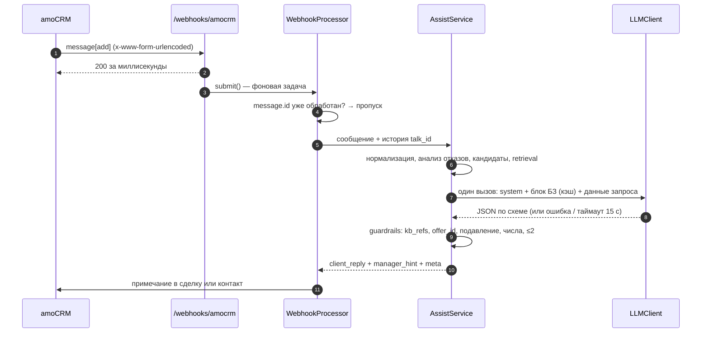

# Архитектура

Сервис получает сообщение клиента и историю чата, а возвращает черновик ответа по базе знаний (БЗ) и подсказку менеджеру по допродаже.
Главный принцип: **LLM формулирует, а код гарантирует**. Всё, что нельзя нарушать (факты, допродажа только из разрешённого, отказы, жалобы), проверяет детерминированный код до и после вызова модели.

## Компоненты

### Путь одного запроса

## Слои и направление зависимостей

| Слой | Что делает | Может зависеть от |
|---|---|---|
| `app/kb` | Схема и загрузка БЗ, ссылочная целостность, Retriever | — |
| `app/upsell` | Упоминания товаров, предложения и отказы в диалоге, кандидаты допродажи | `kb` |
| `app/llm` | `LLMClient`, промпты, FakeLLM, Anthropic-адаптер | `kb`, `upsell`, утилиты `core` |
| `app/core` | `AssistService`, guardrails, сигналы, контракт API | `kb`, `upsell`, `llm` (протокол и схема) |
| `app/integrations/amocrm` | Вебхук, история, примечания | `core` |
| `app/api`, `app/container.py`, `app/cli.py` | HTTP, UI, сборка зависимостей | всё |

`core`, `kb` и `upsell` не импортируют FastAPI, httpx и SDK провайдеров. Это проверяет тест `tests/unit/test_layers.py`: он разбирает импорты через AST и сам проверяет, что ловит нарушения.
Внешние зависимости (LLM, amoCRM, хранилище истории) спрятаны за протоколами (`LLMClient`, `NotesClient`, `DialogStore`, `Retriever`) и собираются в одном месте — `app/container.py`.

## Архитектурные решения (ADR)

### ADR-001. Retrieval без векторной БД

**Контекст.** БЗ короткая: в демо 20 записей и 6 правил, по SPEC — до ~50. У текущих моделей Claude кэшируется префикс от 512 токенов.

**Решение.**
- `Retriever` — протокол.
- По умолчанию `FullContextRetriever`: вся БЗ в промпте одним стабильным блоком `<knowledge_base>` с `cache_control`. Модель видит все факты, повторные запросы читают БЗ из кэша.
- `KeywordRetriever` — BM25 по основам Snowball (ru/en), корни основ с весом 0.5 и бонус за упоминание товара по алиасу. Нужен для ранжирования `kb_refs`, для FakeLLM и для роста БЗ.
- `KB_RETRIEVER=auto` переключается на top-k + все политики, когда в БЗ больше 200 записей или ~30 тыс. токенов.

**Отвергнуто.**
- Эмбеддинги и векторная БД (pgvector, Chroma): лишняя инфраструктура и недетерминированность, а на 50 записях выигрыша нет.
- LangChain: не нужен для одного вызова.

**Последствия.** Без внешних сервисов, дёшево за счёт кэша. На маленькой БЗ модель не может «не найти» факт. Слабое место BM25 — разные формы одного слова; оно закрыто совпадением по корню, тестами и формулировками клиентов в БЗ (навык kb-edit).

### ADR-002. Гибридная допродажа: кандидаты строит код, LLM выбирает и формулирует

**Контекст.** Если модель сама решает, что продавать, она придумывает товары. Если работают только правила — фразы шаблонные и не учитывают диалог.

**Решение.**
- `app/upsell` детерминированно строит кандидатов: правила БЗ × теги товаров сделки × слова клиента.
- Из истории чата код понимает, что менеджер уже предлагал и от чего клиент отказался. Реплика делится на фрагменты, вопросы отказом не считаются, повторный интерес снимает отказ.
- LLM видит только `<upsell_candidates>` и `<declined>`, выбирает ≤ 2 и пишет фразу.
- `title` и основание (`why`) берутся из БЗ, от модели — только формулировки.
- Отказы объединяются из кода и из ответа LLM: объединение может только сузить допродажу.

**Отвергнуто.** «Модель предлагает что хочет»: галлюцинации товаров и нечего тестировать. «Только правила»: не учитывает контекст.

**Последствия.** Жёсткие метрики допродажи (`offer_id` ⊆ кандидатов, отклонённое не повторяется) держатся на коде, а не на послушании модели. Бизнес меняет правила в YAML без правки кода.

### ADR-003. Один вызов LLM со structured output

**Контекст.** Бюджет p50 < 4 с. Выход должен валидироваться. У Opus 5.5 и Sonnet 5.5 принудительный `tool_choice` возвращает 400.

**Решение.**
- Один запрос `messages.create`. JSON-схема выхода (`output_config.format`) генерируется из Pydantic-модели `LLMOutput` через `anthropic.transform_schema`.
- Общий дедлайн 15 с на вызов вместе с повтором. Ретраи SDK выключены, при невалидном JSON — 1 повтор.
- `refusal` и любая ошибка SDK → `LLMError` → шаблонный фолбэк на языке клиента.
- `temperature` передаётся только моделям, которые её принимают (в SDK 1.x — через `extra_body`).
- Модель по умолчанию `claude-opus-5-5` с `effort=low`, всё настраивается через env.
- Промпты лежат в файлах с `PROMPT_VERSION`, история версий — в `docs/PROMPTS.md`.

**Отвергнуто.** Цепочка «классификатор → ретривер → писатель» или агент: задержка ×2–3 при том же качестве на короткой БЗ. Свободный текст с разбором регулярками.

**Последствия.** Предсказуемые задержка и стоимость (`meta.tokens_*`, `meta.cost_usd`). Качество держится на одном промпте, поэтому evals обязательны.

### ADR-004. Вебхук amoCRM: мгновенный ответ, фоновая обработка, примечание `common`

**Контекст.**
- amoCRM ждёт ответ ≤ 2 с.
- Повторяет доставку: через 5 и 15 минут, затем через 15 минут и 1 час, в зависимости от кода ответа.
- Отключает хук, если за 2 часа пришло больше 100 невалидных ответов.
- Тело — `x-www-form-urlencoded`, подписи нет.
- Чат может быть привязан к сделке или к контакту (в примере документации — `element_type=1`).

**Решение.**
- Роут разбирает форму и отвечает 200 сразу — даже на мусор, чтобы хук не отключили.
- Обработка идёт в отслеживаемой `asyncio`-задаче. `BackgroundTasks` не подходят: их выполнение не отделить от ответа в тестах, а значит, честно проверить < 2 с нельзя.
- Идемпотентность по `message.id`. Отметка ставится только после успеха, поэтому повторная доставка после сбоя обрабатывается заново.
- Блокировка на `talk_id` сохраняет порядок реплик.
- `outgoing_message` (реплики менеджера) пополняют историю — так сервис видит «работу менеджера в диалоговом окне».
- Сообщения без текста в LLM не уходят.
- Примечание `note_type=common` пишется в `leads/{id}` или `contacts/{id}` по привязке чата.
- Защита — свой секрет в `?token=`.

**Отвергнуто.**
- Синхронная генерация: таймауты и отключение хука.
- Очередь (Celery/Redis): избыточно для тестового. Протоколы `DialogStore` и `NotesClient` позволяют её добавить.
- `extended_service_message` удобнее сворачивается в интерфейсе, но `common` проще и точно документирован.

**Последствия.** История и отметки о дубликатах живут в памяти одного процесса: рестарт их теряет, несколько воркеров не поддерживаются (SPEC §12 выносит персистентность за скоуп).

### ADR-005. FakeLLM — полноценный офлайн-провайдер

**Контекст.** Проверяющий должен запустить проект за минуту без ключа. Evals должны быть быстрыми и детерминированными.

**Решение.** `FakeLLM` реализует тот же `LLMClient` и работает по структурированному контексту запроса:
- интент — по словарю;
- ответ — дословно из найденных записей БЗ;
- части вопроса, где есть слова или числа вне БЗ, получают «уточню и вернусь» и `needs_manager`;
- допродажа — первые подходящие кандидаты, сначала названные клиентом.

Для тестов умеет вернуть заданный ответ, упасть или «зависнуть». По умолчанию `LLM_PROVIDER=fake`.

**Отвергнуто.** Запись и воспроизведение реальных ответов: расходятся с промптом при каждой правке и не работают на новом вводе. Минимальная заглушка: демо без ключа было бы бесполезным.

**Последствия.** Демо и evals работают офлайн, жёсткие метрики проверяются в каждом `make check`. Fake не измеряет качество формулировок модели — для этого `make evals-real`.

### ADR-006. Guardrails в коде, а не только в промпте

**Контекст.** Инварианты (нет выдуманных фактов, допродажа только из кандидатов, никакой допродажи при жалобе, не повторять отклонённое) нельзя доверять одной модели.

**Решение.** После LLM — цепочка чистых функций `(draft, ctx) -> bool`, сработавшие попадают в `meta.guardrails_applied`:
1. `kb_refs` ⊆ БЗ.
2. `offer_id` ⊆ кандидатов, не из отклонённых, интентное условие правила выполнено.
3. Подавление допродажи при жалобе, возврате, негативе или инъекции — по интенту и тону от LLM **или** по детерминированному словарю (`app/core/signals.py`).
4. Каждое число в ответе клиенту есть в БЗ или диалоге. Иначе `unverified_number` и `needs_manager`.
5. Число из вопроса клиента, которого нет ни в БЗ, ни в ответе («рассрочка на 36 месяцев»), — `unanswered_number` и `needs_manager`.
6. Не больше 2 предложений.

До LLM: пустое сообщение или бессмысленный набор букв получает уточняющий вопрос без вызова модели. Текст клиента экранируется: закрыть наши теги из сообщения нельзя.

**Последствия.** Жёсткие метрики evals — свойство кода, а не удачного промпта. Цена — редкие лишние `needs_manager` (осознанная строгость числового контроля).

### ADR-007. Язык сообщения без внешних библиотек

**Решение.** Язык определяется по доле кириллицы и латиницы (ru/en), язык ответа — по тексту ответа, при расхождении ставится флаг `language_mismatch`. `langdetect` и аналоги не нужны для S9 и медленнее на коротких сообщениях.

**Последствия.** Другие языки определяются как `en` по латинице — достаточно для демо, в «что дальше».

---

## Зависимости

Каждая новая зависимость добавляется сюда с обоснованием.

### Runtime

| Пакет | Зачем | Почему не альтернатива |
|---|---|---|
| fastapi | HTTP API, демо UI, вебхук amoCRM, DI через `Depends` | Требование стека; типизирован, Pydantic v2 из коробки |
| uvicorn | ASGI-сервер | Стандарт для FastAPI; без `[standard]`-extras — меньше образ |
| pydantic | Модели на всех границах (HTTP, БЗ, ответ LLM, payload вебхука) | Требование стека |
| pydantic-settings | Конфиг из env/.env с валидацией на старте | Та же модель валидации, что и везде; без самописного парсинга env |
| pyyaml | Чтение БЗ из YAML (`safe_load`), номера строк в синтаксических ошибках | Формат БЗ задан SPEC §5; ruamel.yaml тяжелее и нужен только для записи с комментариями |
| snowballstemmer | Стемминг ru/en для BM25 («доставку/доставки» → «доставк») | Чистый Python, без нативных зависимостей; pymorphy3 точнее, но тянет словари на ~10 МБ, а для ранжирования 20–50 записей стемминга достаточно. Типов нет — `ignore_missing_imports` точечно |
| anthropic | Официальный SDK Claude: `AsyncAnthropic`, structured output (`output_config.format` + `transform_schema`), prompt caching, серверный fallback при refusal. Используется только в `app/llm/anthropic_client.py` и грузится лениво | Требование стека; сырой HTTP означал бы самописные типы, ретраи и ошибки. SDK 1.x работает на `httpx2` — та же библиотека, что у TestClient |
| httpx2 | HTTP-клиент для API amoCRM (`LiveNotesClient`) и транспорт `TestClient` | Преемник `httpx` (он указан в стеке CLAUDE.md): на нём работают Anthropic SDK 1.x и TestClient в Starlette 1.x — одна HTTP-библиотека на весь проект |

### Dev

| Пакет | Зачем |
|---|---|
| pytest, pytest-asyncio | Тесты, в т.ч. async-пайплайна |
| pytest-cov | Покрытие `app/core`, `app/kb`, `app/upsell`; порог 85% в `make check` |
| types-PyYAML | Типы для mypy strict |
| ruff | Линтер и форматтер |
| mypy | Проверка типов; strict для `app/`, `evals/` и `tests/` (CLAUDE.md требует strict минимум для `core`, `kb`, `upsell`) |
